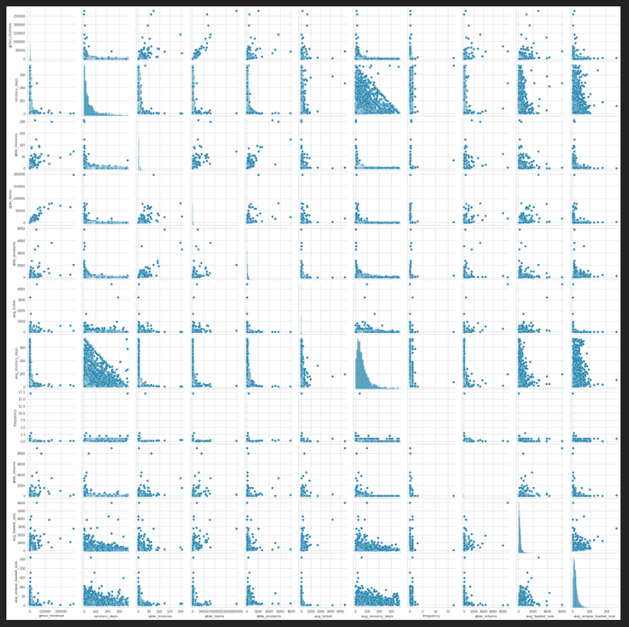
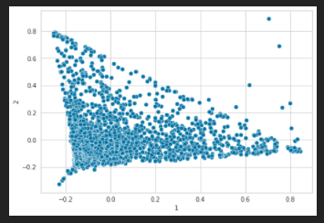
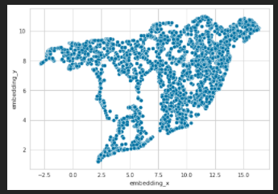
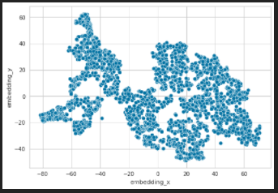
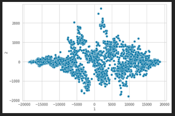
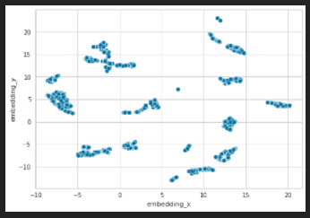
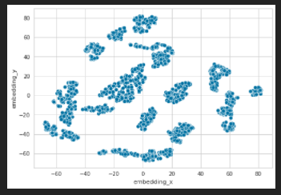
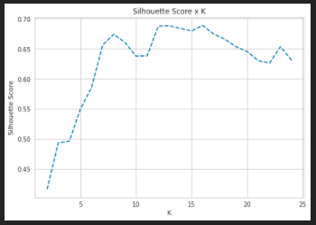
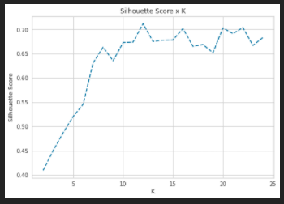
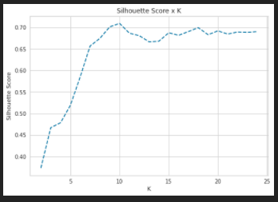

### Hi there 👋

# Lucas Ezequiel 
*Junior Data Scientist*

I´m a data science student focused on project development. Since the beggining of 2020 I´ve developed solutions for business problems such as predicting sales values, prediction clients in churn, classifying fraudulent transactions, clustering customer segmentation, predicting customer behaviour, etc. 

In total, the projects I´ve developed so far acomplish a basic range of topics for an aspiring data scientist. Those are: regression problems, classification problems, clustering problems and ETL construction.

### **Analytical Tools:**

**Data Collect and Storage:** SQL, MySQL, web scraping.

**Data Processing and Analysis:** Python, PySpark.

**Development:** Git, Linux. 

**Data Vizualization:** Power BI.

**Machine Learning Modeling:** Classification, Regression, Clustering. 

**Machine Learning Deployment:** Flask, Heroku.

**Links:**
* 
* 

# [Insiders Clustering](https://github.com/LucasBMedeiros/insiders_clustering)

## Business Problem

A UK-based online retail store has captured the sales data for different products for the period of one year (Nov 2016 to Dec 2017). The organization sells gifts primarily on the online platform. The customers who make a purchase consume directly for themselves. There are small businesses that buy in bulk and sell to other customers through the retail outlet channel. The company needs to find significant customers for the business who make high purchases of their favourite products, with the intent of rolling out a loyalty program to the high-value customers after identification of segments. Use the clustering methodology to segment customers into groups.

## Business Assumptions

## Solution - Step by Step

1. Data Collection
2. Data Filtering
3. Feature Engineering
4. EDA (Exploratory Data Analysis)
5. Data Preparation
6. Feature Selection
7. Hyperparameter Fine Tuning
8. Model Training
9. Cluster Analysis

## EDA and Space Study

:--:
<b>Pairplot Analysis of dataset after feature engineering</b>

:--:
<b>Pairplot Analysis of dataset after feature engineering</b>

:--:
<b>Pairplot Analysis of dataset after feature engineering</b>

:--:
<b>Pairplot Analysis of dataset after feature engineering</b>

:--:
<b>Pairplot Analysis of dataset after feature engineering</b>

:--:
<b>Pairplot Analysis of dataset after feature engineering</b>

:--:
<b>Pairplot Analysis of dataset after feature engineering</b>

## Hyper Parameter Fine Tuning

:--:
<b>Pairplot Analysis of dataset after feature engineering</b>

:--:
<b>Pairplot Analysis of dataset after feature engineering</b>

:--:
<b>Pairplot Analysis of dataset after feature engineering</b>

## Modelling

:--:
<b>Pairplot Analysis of dataset after feature engineering</b>

# Cluster Analysis

## 

## Deploy 

# [Fraudulent Financial Transactions Detector](https://github.com/LucasBMedeiros/fraud_blocker)

## Business Problem

## Business Assumptions

## Solution - Step by Step

1. Data Collection
2. Data Descrition and Cleaning
3. Feature Engineering
4. Filtering
5. EDA (Exploratory Data Analysis)
6. Data Preparation
7. Feature Selection
8. Machine Learning Modelling
9. Hyper-parameter Fine Tuning

## Model Performance

## Business Impact

## Deploy 

# [AirBnb First Booking Prediction](https://github.com/LucasBMedeiros/airbnb_first_booking)

## Business Problem

## Business Assumptions

## Solution - Step by Step

1. Data Collection
2. Data Descrition and Cleaning
3. Feature Engineering
4. Filtering
5. EDA (Exploratory Data Analysis)
6. Data Preparation
7. Feature Selection
8. Machine Learning Modelling
9. Hyper-parameter Fine Tuning

## Model Performance

## Business Impact

## Deploy 

# [Rossmann Sales Prediction](https://github.com/LucasBMedeiros/rossmann-sales)

## Business Problem

## Business Assumptions

## Solution - Step by Step

1. Data Collection
2. Data Descrition and Cleaning
3. Feature Engineering
4. Filtering
5. EDA (Exploratory Data Analysis)
6. Data Preparation
7. Feature Selection
8. Machine Learning Modelling
9. Hyper-parameter Fine Tuning

## Model Performance

## Business Impact

## Deploy 

# [Health Insurance Cross Sell](https://github.com/LucasBMedeiros/health_insurance_cross-sell/tree/master/health_insurance_cross-sell)

## Business Problem

## Business Assumptions

## Solution - Step by Step

1. Data Collection
2. Data Descrition and Cleaning
3. Feature Engineering
4. Filtering
5. EDA (Exploratory Data Analysis)
6. Data Preparation
7. Feature Selection
8. Machine Learning Modelling
9. Hyper-parameter Fine Tuning

## Model Performance

## Business Impact

## Deploy 

# [Client Churn Prediction](https://github.com/LucasBMedeiros/churn_prediction)

## Business Problem

## Business Assumptions

## Solution - Step by Step

1. Data Collection
2. Data Descrition and Cleaning
3. Feature Engineering
4. Filtering
5. EDA (Exploratory Data Analysis)
6. Data Preparation
7. Feature Selection
8. Machine Learning Modelling
9. Hyper-parameter Fine Tuning

## Model Performance

## Business Impact

## Deploy 

# [Google BigQuery - Customer Segmentation]()

## Business Problem

## Business Assumptions

## Solution - Step by Step

1. Data Collection
2. Data Descrition and Cleaning
3. Feature Engineering
4. Filtering
5. EDA (Exploratory Data Analysis)
6. Data Preparation
7. Feature Selection
8. Machine Learning Modelling
9. Hyper-parameter Fine Tuning

## Model Performance

## Business Impact

## Deploy 

# [Stroke Prediction](https://github.com/LucasBMedeiros/stroke_prediction)

## Business Problem

## Business Assumptions

## Solution - Step by Step

1. Data Collection
2. Data Descrition and Cleaning
3. Feature Engineering
4. Filtering
5. EDA (Exploratory Data Analysis)
6. Data Preparation
7. Feature Selection
8. Machine Learning Modelling
9. Hyper-parameter Fine Tuning

## Model Performance

## Business Impact

## Deploy 

# [Web Scraping and ETL for Product Pricing]()

## Business Problem

## Business Assumptions

## Solution - Step by Step

1. Data Collection (Web Scraping)
2. Data Descrition and Cleaning
3. Feature Engineering
4. Filtering
5. EDA (Exploratory Data Analysis)

