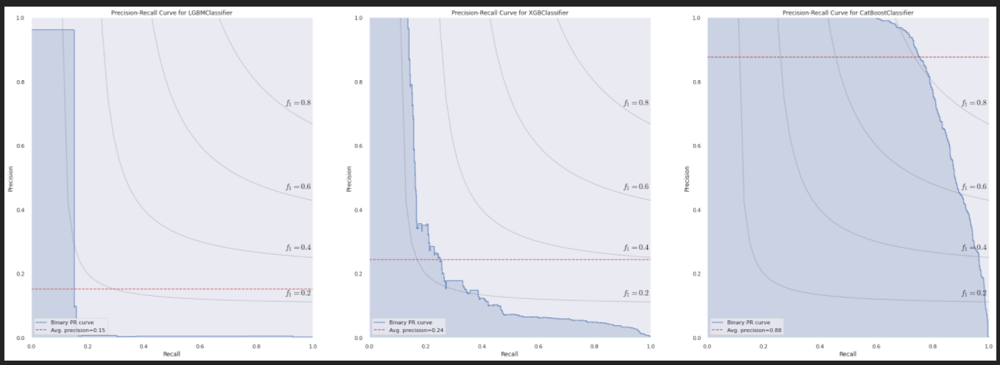

Civil Engineer and data science practitioner focused on project development. Since 2020 I´ve developed solutions for business problems such as predicting sales revenue, prediction clients in churn, classifying fraudulent transactions, clustering customer segmentation, predicting customer behaviour, etc. 

In total, the projects I´ve developed so far acomplish a basic range of topics for an aspiring data scientist. Those are: regression problems, classification problems, clustering problems and ETL construction.

**Find me at:**
* 
* 

# Rossmann Sales Prediction

1. Business Problem
2. Project Goals
3. Deliverables
4. Model´s Performance
5. Business Impact
6. Deploy Test and Setup

# AirBnb First Booking Prediction

1. Business Problem
2. Project Goals
3. Deliverables
4. Model´s Performance
5. Business Impact
6. Deploy Test and Setup

# Customer Insurance Interest - Learning to Rank

1. Business Problem
2. Project Goals
3. Deliverables
4. Model´s Performance
5. Business Impact
6. Deploy Test and Setup

# BigQuery - Google Merchandising Customer Behaviour

1. Business Problem
2. Project Goals
3. Deliverables
4. Model´s Performance
5. Business Impact
6. Deploy Test and Setup

# Fraudulent Transactions Blocker

1. Business Problem.

The Blocker Fraud Company is a specialized company in fraud detection on financial transactions. It has the Blocker Fraud service, which ensures the block of fraudulent transactions. The company's business model is service's performance monetization.

2. Business Assumptions.

The company aims to expand its business, by following the given rules:
1. The company receives 25% of each transaction value truly detected as fraud.
2. The company receives 5% of each transaction value detected as fraud, however the transaction is legitimate.
3. The company gives back 100% of the value for the customer in each transaction detected as legitimate, however the transaction is actually a fraud.

3. Project Goals

- Create a model with high accuracy and precision when classifying transaction between fraud and non-fraud.

4. Deliverables

- A model that classifies the transactions as "Fraud" or "Legitimate".
- Deployed model with API access. 
- A Readme about how to use the tool.
- Model performance and results report with respect to profit and loss. 

5. Model´s performance on test set

- 

6. Business Impact

# Price Estimation and Competition Analysis - ETL and Web Scraping

1. Business Problem
2. Project Goals
3. Deliverables
4. Model´s Performance
5. Business Impact
6. Deploy Test and Setup

# Client Churn Prediction

1. Business Problem
2. Project Goals
3. Deliverables
4. Model´s Performance
5. Business Impact
6. Deploy Test and Setup

